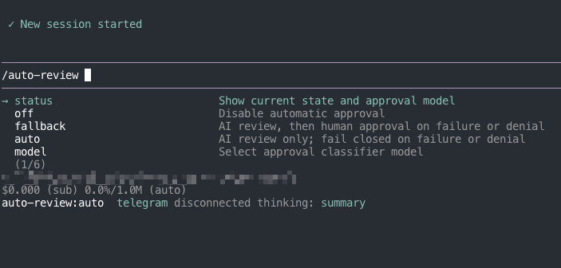
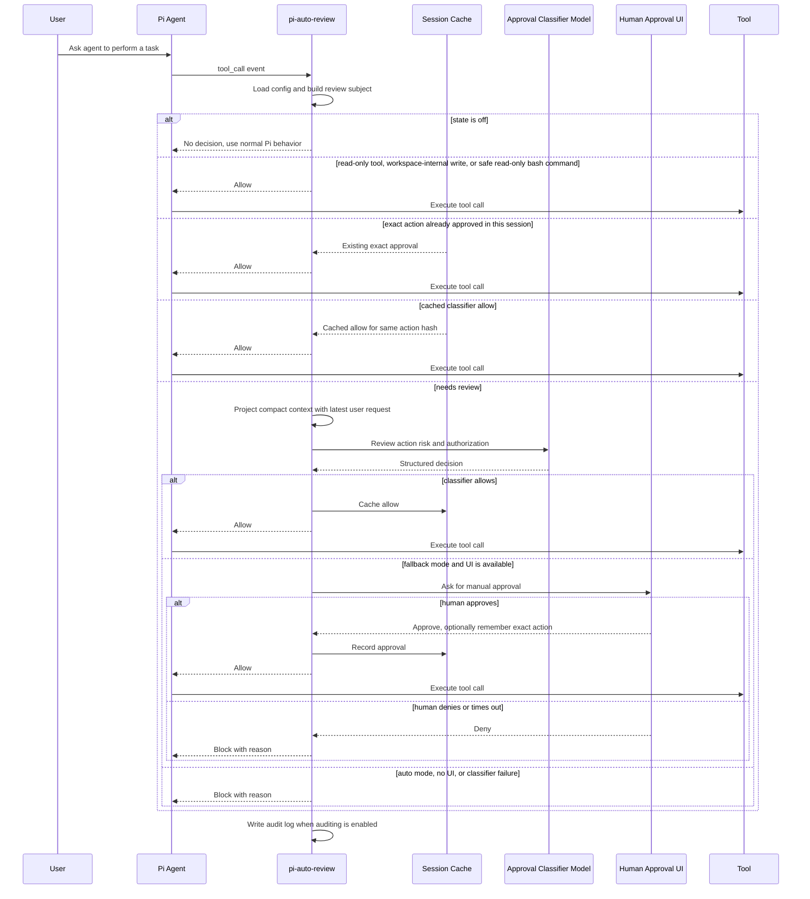

# pi-auto-review

Pi agent automatic approval extension powered by an AI classifier.

The extension is disabled by default. Use `/auto-review fallback` for the recommended interactive mode, `/auto-review auto` for unattended fail-closed mode, or `/auto-review off` to disable automatic approval.

## Installation

Install from GitHub:

```bash
pi install git:github.com:<user>/pi-auto-review
```

Install a pinned release:

```bash
pi install git:github.com:<user>/pi-auto-review@v0.1.0
```

Install only for the current project:

```bash
pi install -l git:github.com:<user>/pi-auto-review
```

Reload Pi and enable the recommended mode:

```text
/reload
/auto-review fallback
```

## Commands

`/auto-review` is the only slash command. Type `/auto-review ` with a trailing space to see available arguments.

| Command | Effect |
| --- | --- |
| `/auto-review status` | Show current state, approval classifier model, config path, and audit log path. |
| `/auto-review off` | Disable automatic approval. Tool approvals return to Pi's normal behavior. |
| `/auto-review fallback` | Enable AI review with human approval fallback when the classifier denies or fails. |
| `/auto-review auto` | Enable AI review only. Classifier denial or failure blocks the tool call. |
| `/auto-review model` | Open the model selector for the approval classifier model. |
| `/auto-review model current` | Use the active Pi session model for approval classification. |
| `/auto-review model <model-id>` | Use a dedicated classifier model with the current provider. |
| `/auto-review model <provider>/<model-id>` | Use a dedicated classifier model from a specific provider. |

## Screenshot

`/auto-review` argument completions expose the available modes and model selector directly in Pi.



## Architecture

pi-auto-review sits between Pi tool calls and the normal approval path:

- command layer registers `/auto-review` and persists local config;
- routing layer fast-paths disabled, read-only, workspace-safe, and session-approved actions;
- classifier layer projects recent session context and asks the selected model for a structured allow or deny decision;
- fallback layer asks the user when classifier review cannot safely approve;
- audit layer writes JSONL records when auditing is enabled.

## Approval Flow



## States

`off` means the extension does not make automatic approval decisions.

`fallback` means the classifier gets the first chance to approve risky tool calls. If it allows, the tool runs. If it denies, fails, times out, or the tool is manual-only, Pi asks the human through the approval UI when UI is available.

`auto` means the classifier is the approval gate. A classifier allow runs the tool. A classifier deny, failure, timeout, manual-only tool, or repeated denial blocks the tool call.

## Safety

`fallback` is the recommended mode for normal interactive use. It lets the classifier approve low-risk work, but keeps human approval available when the classifier denies, fails, or times out.

`auto` is fail-closed and should be used only in trusted unattended contexts. Classifier failures and denials block the tool call.

## Classifier Model

By default, the approval classifier uses the current Pi session model. Use `/auto-review model` to choose another available model from Pi's model selector.

The selected value is stored as `classifierModel` in `config.jsonc`. `null` means "use the current session model".

## Files

- `config.jsonc`: extension configuration.
- `logs/pi-auto-review.jsonl`: audit decisions when auditing is enabled.

## References

This extension is an independent Pi package. Its approval workflow and terminal interaction design were informed by OpenAI Codex CLI and Claude Code-style coding-agent permission flows.

## Pi Smoke Regression

Run the local Pi-side smoke regression with:

```bash
npm run smoke:pi
```

The smoke script runs in temporary config and log directories. It verifies `/auto-review fallback`, `/auto-review auto`, safe bash command allow, suspicious bash command human fallback or denial, and JSONL audit log contents.
