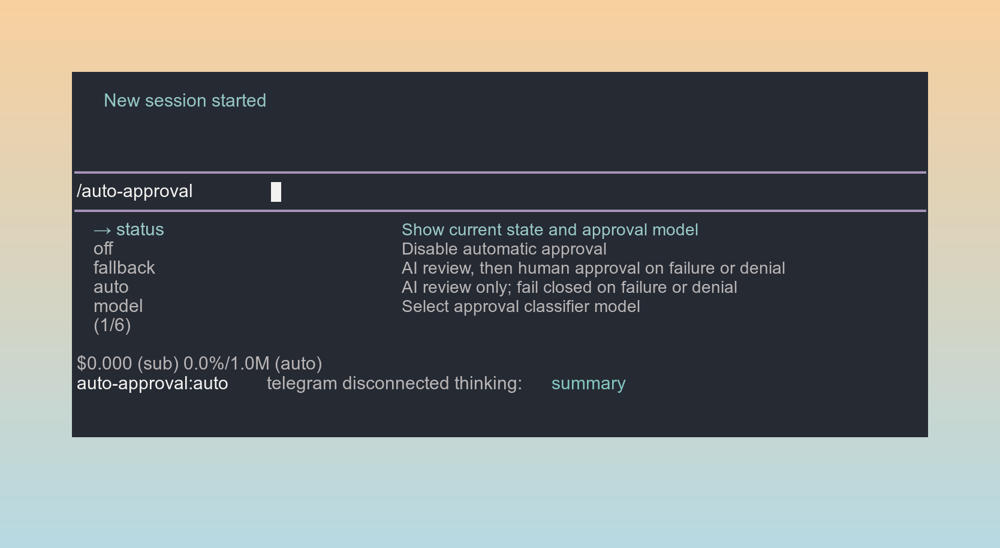
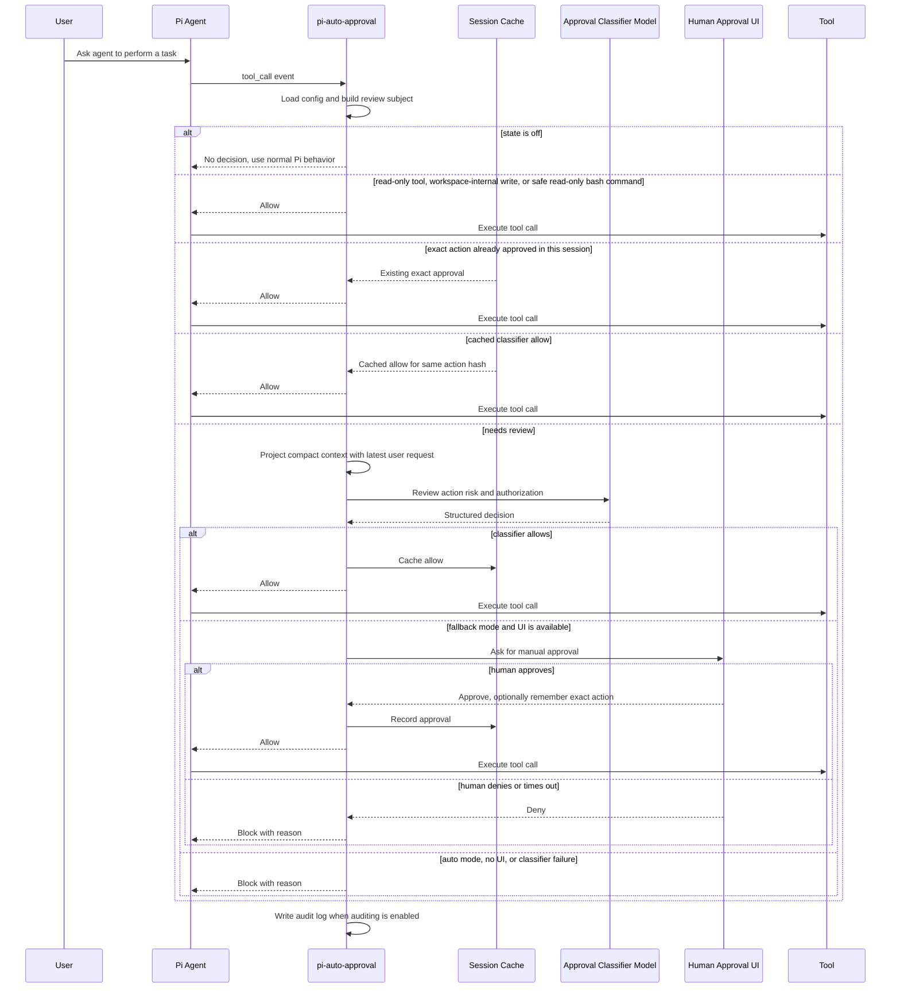

# pi-auto-approval

English | [中文](./README.zh-CN.md)

pi-auto-approval is an automatic approval extension built for Pi. It brings a Claude Code auto mode and Codex Auto-review inspired approval workflow to Pi.

When a Pi agent requests a tool call, the extension asks an AI classifier whether the action can be safely approved. Low-risk actions can be approved automatically; risky, denied, failed, or uncertain actions fall back to human approval or are blocked, depending on the selected mode.

If you like Claude Code auto mode for reducing repetitive permission prompts, or want a Codex Auto-review style approval boundary with human fallback inside Pi, this extension is built for that workflow.

The extension is disabled by default. Use `/auto-approval fallback` for the recommended interactive mode, `/auto-approval auto` for unattended fail-closed mode, or `/auto-approval off` to disable automatic approval.

## Installation

Install from GitHub:

```bash
pi install https://github.com/Europa2061/pi-auto-approval
```

Install a pinned release:

```bash
pi install https://github.com/Europa2061/pi-auto-approval@v0.1.0
```

Install only for the current project:

```bash
pi install -l https://github.com/Europa2061/pi-auto-approval
```

Reload Pi and enable the recommended mode:

```text
/reload
/auto-approval fallback
```

## Commands

`/auto-approval` is the only slash command. Type `/auto-approval ` with a trailing space to see available arguments.

| Command | Effect |
| --- | --- |
| `/auto-approval status` | Show current state, approval classifier model, config path, and audit log path. |
| `/auto-approval off` | Disable automatic approval. Tool approvals return to Pi's normal behavior. |
| `/auto-approval fallback` | Enable AI review with human approval fallback when the classifier denies or fails. |
| `/auto-approval auto` | Enable AI review only. Classifier denial or failure blocks the tool call. |
| `/auto-approval model` | Open the model selector for the approval classifier model. |
| `/auto-approval model current` | Use the active Pi session model for approval classification. |
| `/auto-approval model <model-id>` | Use a dedicated classifier model with the current provider. |
| `/auto-approval model <provider>/<model-id>` | Use a dedicated classifier model from a specific provider. |

## Screenshot

`/auto-approval` argument completions expose the available modes and model selector directly in Pi.



## Architecture

pi-auto-approval sits between Pi tool calls and the normal approval path:

- command layer registers `/auto-approval` and persists local config;
- routing layer fast-paths disabled, read-only, workspace-safe, and session-approved actions;
- classifier layer projects recent session context and asks the selected model for a structured allow or deny decision;
- fallback layer asks the user when classifier review cannot safely approve;
- audit layer writes JSONL records when auditing is enabled.

## Approval Flow



## States

`off` means the extension does not make automatic approval decisions.

`fallback` means local fast paths handle actions that are already known to be low risk, such as trusted read-only tools, workspace-internal writes, explicitly allowlisted safe commands, or exact actions already approved in the session. Other tool calls go to the classifier first. If it allows, the tool runs. If it denies, fails, times out, or the tool is manual-only, Pi asks the human through the approval UI when UI is available.

`auto` means non-fast-path tool calls use the classifier as the approval gate. Local fast paths can still allow actions that are statically known to be low risk or already approved in the current session. For reviewed actions, a classifier allow runs the tool; a classifier deny, failure, timeout, manual-only tool, or repeated denial blocks the tool call.

## Safety

`fallback` is the recommended mode for normal interactive use. It lets local fast paths and the classifier reduce repeated prompts, but keeps human approval available when the classifier denies, fails, or times out.

`auto` is fail-closed for reviewed actions and should be used only in trusted unattended contexts. Classifier failures and denials block the tool call. Any local fast path must be narrowly defined and statically low risk; otherwise the action is reviewed or blocked.

## Classifier Model

By default, the approval classifier uses the current Pi session model. Use `/auto-approval model` to choose another available model from Pi's model selector.

The selected value is stored as `classifierModel` in `config.jsonc`. `null` means "use the current session model".

## Files

- `config.jsonc`: extension configuration.
- `logs/pi-auto-approval.jsonl`: audit decisions when auditing is enabled.

## References

This extension is an independent Pi package. Its approval workflow and terminal interaction design were informed by OpenAI Codex CLI and Claude Code-style coding-agent permission flows.

## Pi Smoke Regression

Run the local Pi-side smoke regression with:

```bash
npm run smoke:pi
```

The smoke script runs in temporary config and log directories. It verifies `/auto-approval fallback`, `/auto-approval auto`, safe bash command allow, suspicious bash command human fallback or denial, and JSONL audit log contents.
