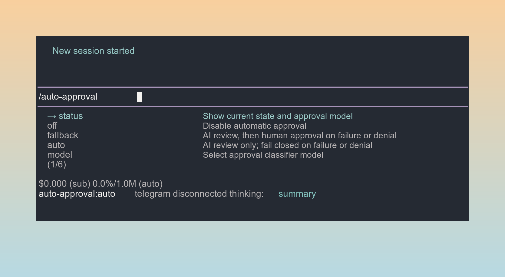
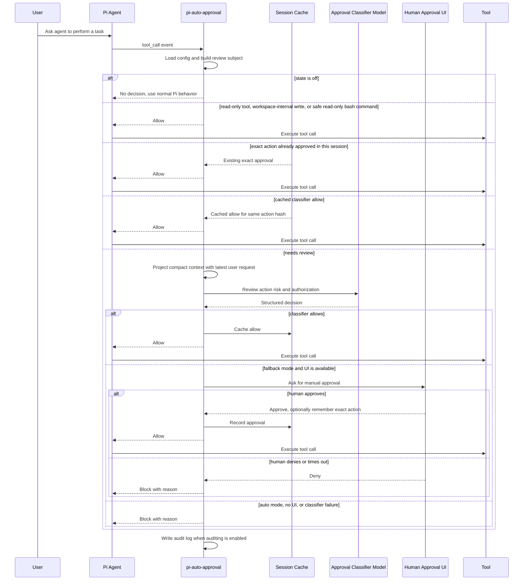

# pi-auto-approval

English | [中文](./README.zh-CN.md)

pi-auto-approval is an automatic approval extension for Pi, inspired by Claude Code auto mode and Codex Auto-review.

It uses an AI classifier to approve low-risk tool calls. Risky, denied, failed, or uncertain actions fall back to human approval or are blocked by the selected mode.

## Installation

Install from npm (recommended):

```bash
pi install npm:pi-auto-approval
```

Install a pinned release:

```bash
pi install npm:pi-auto-approval@0.1.0
```

Install only for the current project:

```bash
pi install -l npm:pi-auto-approval
```

Reload Pi and enable the recommended mode:

```text
/reload
/auto-approval fallback
```

### Migrate from a GitHub installation

Pi treats GitHub and npm sources as different packages. Remove the GitHub installation before using the npm package so the extension is not loaded twice.

Before removing it, run `/auto-approval status` and back up the displayed `config.jsonc` if you want to keep custom settings. The default config path is inside the installed package and does not move automatically between package sources.

For a user installation:

```bash
pi remove https://github.com/Europa2061/pi-auto-approval
pi install npm:pi-auto-approval
```

For a project-local installation:

```bash
pi remove -l https://github.com/Europa2061/pi-auto-approval
pi install -l npm:pi-auto-approval
```

Start Pi again, restore the config to the new path shown by `/auto-approval status` if needed, then run `/reload`. The unpinned remove command also matches an installation pinned to a Git tag such as `@v0.1.0`.

GitHub installation remains available as an alternative:

```bash
pi install https://github.com/Europa2061/pi-auto-approval
```

## Commands

`/auto-approval` is the only slash command. Type `/auto-approval ` with a trailing space to see available arguments.

| Command | Effect |
| --- | --- |
| `/auto-approval status` | Show current state, approval classifier model, config path, and audit log path. |
| `/auto-approval off` | Disable automatic approval. Tool approvals return to Pi's normal behavior. |
| `/auto-approval fallback` | Enable AI review with human approval fallback when the classifier denies or fails. |
| `/auto-approval auto` | Enable AI review only. Classifier denial or failure blocks the tool call. |
| `/auto-approval classifier` | Choose between the existing LLM classifier and Jev. |
| `/auto-approval classifier llm` | Use the existing LLM classifier. |
| `/auto-approval classifier jev` | Use Jev (`jev-latest`). |
| `/auto-approval model` | Open the model selector for the approval classifier model. |
| `/auto-approval model current` | Use the active Pi session model for approval classification. |

## Screenshot

`/auto-approval` argument completions expose the available modes and model selector directly in Pi.



## Architecture

pi-auto-approval sits between Pi tool calls and the normal approval path:

- command layer registers `/auto-approval` and persists local config;
- routing layer fast-paths disabled, read-only, workspace-safe, and session-approved actions;
- classifier layer routes review to either the existing LLM classifier or a structured decision provider;
- fallback layer asks the user when classifier review cannot safely approve;
- audit layer writes JSONL records when auditing is enabled.

## Approval Flow


```mermaid
sequenceDiagram
    participant User
    participant Pi as Pi Agent
    participant Ext as pi-auto-approval
    participant Store as Session Cache
    participant Classifier as Approval Classifier Model
    participant Human as Human Approval UI
    participant Tool

    User->>Pi: Ask agent to perform a task
    Pi->>Ext: tool_call event
    Ext->>Ext: Load config and build review subject

    alt state is off
        Ext-->>Pi: No decision, use normal Pi behavior
    else read-only tool, workspace-internal write, or safe read-only bash command
        Ext-->>Pi: Allow
        Pi->>Tool: Execute tool call
    else exact action already approved in this session
        Store-->>Ext: Existing exact approval
        Ext-->>Pi: Allow
        Pi->>Tool: Execute tool call
    else cached classifier allow
        Store-->>Ext: Cached allow for same action hash
        Ext-->>Pi: Allow
        Pi->>Tool: Execute tool call
    else needs review
        Ext->>Ext: Project compact context with latest user request
        Ext->>Classifier: Review action risk and authorization
        Classifier-->>Ext: Structured decision

        alt classifier allows
            Ext->>Store: Cache allow
            Ext-->>Pi: Allow
            Pi->>Tool: Execute tool call
        else fallback mode and UI is available
            Ext->>Human: Ask for manual approval
            alt human approves
                Human-->>Ext: Approve, optionally remember exact action
                Ext->>Store: Record approval
                Ext-->>Pi: Allow
                Pi->>Tool: Execute tool call
            else human denies or times out
                Human-->>Ext: Deny
                Ext-->>Pi: Block with reason
            end
        else auto mode, no UI, or classifier failure
            Ext-->>Pi: Block with reason
        end
    end

    Ext->>Ext: Write audit log when auditing is enabled
```

## States

`off` means the extension does not make automatic approval decisions.

`fallback` means local fast paths handle actions that are already known to be low risk, such as trusted read-only tools, workspace-internal writes, explicitly allowlisted safe commands, or exact actions already approved in the session. Other tool calls go to the classifier first. If it allows, the tool runs. If it denies, fails, times out, or the tool is manual-only, Pi asks the human through the approval UI when UI is available.

`auto` means non-fast-path tool calls use the classifier as the approval gate. Local fast paths can still allow actions that are statically known to be low risk or already approved in the current session. For reviewed actions, a classifier allow runs the tool; a classifier deny, failure, timeout, manual-only tool, or repeated denial blocks the tool call.

## Safety

`fallback` is the recommended mode for normal interactive use. It lets local fast paths and the classifier reduce repeated prompts, but keeps human approval available when the classifier denies, fails, or times out.

`auto` is fail-closed for reviewed actions and should be used only in trusted unattended contexts. Classifier failures and denials block the tool call. Any local fast path must be narrowly defined and statically low risk; otherwise the action is reviewed or blocked.

## Classifier Model

By default, the approval classifier uses the current Pi session model. Use `/auto-approval model` to choose another available model from Pi's model selector.

The selected value is stored as `classifierModel` in `config.jsonc`. `null` means "use the current session model".

### Jev

Set `TYPESAFE_API_KEY`, then run:

```text
/auto-approval classifier jev
```

This selects the structured decision engine with the `jev` provider and `jev-latest` model. Jev is accessed through TypeSafe's SDK and returns an allow/deny choice plus confidence, probabilities, authorization, and safety signals. The current release uses only the allow/deny choice for approval; the other values are recorded as decision metadata for future policy and calibration support.

Equivalent `config.jsonc`:

```json
{
  "classifier": {
    "engine": "decision",
    "provider": "jev",
    "model": "jev-latest",
    "timeoutSeconds": 10
  }
}
```

The legacy `classifierModel` setting remains supported. Selecting a model with `/auto-approval model` switches back to the LLM classifier.

Decision providers receive a minimal structured state containing the pending action, latest user request, environment guidance, and approval policy. Recent tool output is not sent, and common credential fields and token patterns are redacted before the request.

## References

This extension is an independent Pi package. Its approval workflow and terminal interaction design were informed by OpenAI Codex CLI and Claude Code-style coding-agent permission flows.

## Pi Smoke Regression

Run the local Pi-side smoke regression with:

```bash
npm run smoke:pi
```

The smoke script runs in temporary config and log directories. It verifies `/auto-approval fallback`, `/auto-approval auto`, safe bash command allow, suspicious bash command human fallback or denial, and JSONL audit log contents.
