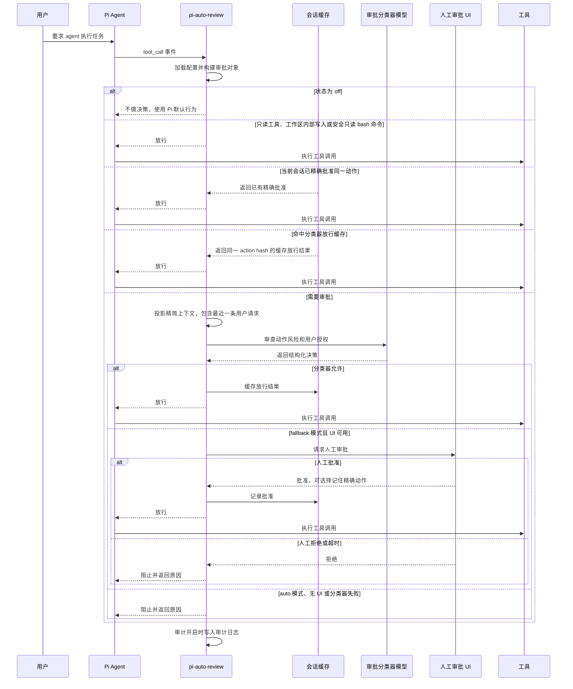

# pi-auto-review

pi-auto-review 是一个 Pi agent 自动审批扩展，使用 AI 分类器判断工具调用是否可以自动放行。

扩展默认关闭。推荐使用 `/auto-review fallback` 开启带人工兜底的交互模式；使用 `/auto-review auto` 开启无人值守的失败即拒绝模式；使用 `/auto-review off` 关闭自动审批。

## 安装

从 GitHub 安装：

```bash
pi install git:github.com:<user>/pi-auto-review
```

安装固定版本：

```bash
pi install git:github.com:<user>/pi-auto-review@v0.1.0
```

只安装到当前项目：

```bash
pi install -l git:github.com:<user>/pi-auto-review
```

重新加载 Pi 并启用推荐模式：

```text
/reload
/auto-review fallback
```

## 命令

`/auto-review` 是唯一的斜杠命令。输入带尾随空格的 `/auto-review ` 可以查看可用参数。

| 命令 | 效果 |
| --- | --- |
| `/auto-review status` | 显示当前状态、审批分类器模型、配置文件路径和审计日志路径。 |
| `/auto-review off` | 关闭自动审批。工具审批回到 Pi 的默认行为。 |
| `/auto-review fallback` | 开启 AI 审批；当分类器拒绝或失败时，回退到人工审批。 |
| `/auto-review auto` | 只使用 AI 审批。分类器拒绝或失败时直接阻止工具调用。 |
| `/auto-review model` | 打开审批分类器模型选择器。 |
| `/auto-review model current` | 使用当前 Pi 会话模型作为审批分类器模型。 |
| `/auto-review model <model-id>` | 使用当前 provider 下的指定模型作为独立审批分类器模型。 |
| `/auto-review model <provider>/<model-id>` | 使用指定 provider 下的指定模型作为独立审批分类器模型。 |

## 审批流程



## 状态

`off` 表示扩展不做自动审批决策。

`fallback` 表示分类器先尝试审批有风险的工具调用。如果分类器允许，工具会执行。如果分类器拒绝、失败、超时，或工具必须人工审批，并且 UI 可用，Pi 会通过审批 UI 询问人工确认。

`auto` 表示分类器是审批关口。分类器允许时工具执行。分类器拒绝、失败、超时、工具必须人工审批，或连续拒绝过多时，工具调用会被阻止。

## 安全提示

普通交互使用推荐 `fallback`。它允许分类器先审批低风险动作，但分类器拒绝、失败或超时时仍会保留人工审批兜底。

`auto` 是失败即拒绝模式，只建议在可信的无人值守场景中使用。分类器失败或拒绝都会阻止工具调用。

## 分类器模型

默认情况下，审批分类器使用当前 Pi 会话模型。使用 `/auto-review model` 可以从 Pi 的模型选择器中选择另一个可用模型。

选中的值会保存为 `config.jsonc` 中的 `classifierModel`。`null` 表示“使用当前会话模型”。

## 文件

- `config.jsonc`: 扩展配置。
- `logs/pi-auto-review.jsonl`: 审计开启时记录的审批决策。

## 参考来源

本扩展是独立的 Pi package。审批工作流和终端交互设计参考了 OpenAI Codex CLI 以及 Claude Code 风格的 coding-agent 权限流程。

## 开源协议

Apache-2.0。协议选择与 OpenAI Codex CLI 对齐。
